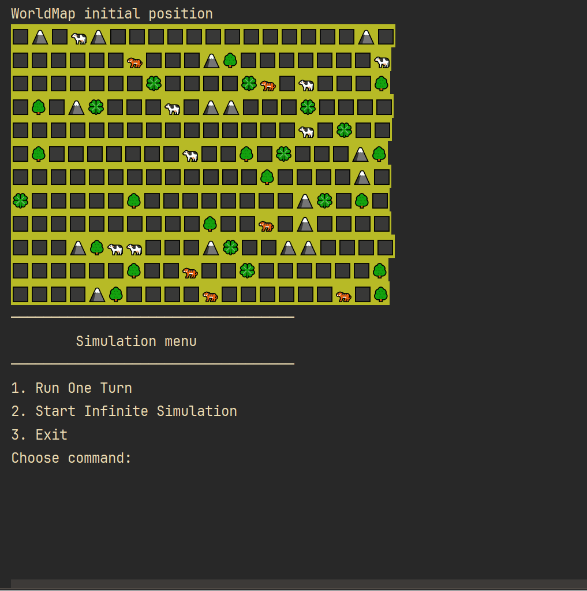

# Симуляция



Моя реализация второго проекта из роадмапа по JAVA, [ТЗ Симуляции](https://zhukovsd.github.io/java-backend-learning-course/projects/simulation/)

Суть проекта реализовать пошаговую симуляцию 2D мира, который населён травоядными (🐄) и хищниками(🐅). Также мир содержит траву (🍀), которую едят травоядные, статичные объекты (🗻, 🌳) с которыми нельзя взаимодействовать - они просто занимают место.
2D мир представляет из себя матрицу NxM, каждое существо или объект занимают клетку целиком, нахождение в клетке нескольких объектов/существ - недопустимо. 


## Особенности

- Есть пауза и пошаговый запуск симуляции
- Реализованы алгоритмы поиска A* и BFS
- При отсутствии еды на поле, существа перемещаются случайно
- Отображение индикатора жизни травоядных и хищников
- Возможно задать фон разного цвета
- И многое другое

## Установка

1. Клонируйте репозиторий:

   ```bash
   git clone https://github.com/GDPixel/Simulation
   ```

2. Перейдите в директорию проекта:

   ```bash
   cd Simulation-master/src/main
   ```

3. Запустите симуляцию:

   ```bash
   java Main.java
   ```


Sure! Here’s the translation to English:

---

# Simulation

This is my implementation of the second project from the Java roadmap, [Simulation Specifications](https://zhukovsd.github.io/java-backend-learning-course/projects/simulation/).

The essence of the project is to implement a step-by-step simulation of a 2D world populated by herbivores (🐄) and predators (🐅). The world also contains grass (🍀), which is eaten by herbivores, and static objects (🗻, 🌳) that cannot be interacted with—they simply occupy space. The 2D world is represented as an NxM matrix, where each creature or object occupies a cell entirely; multiple objects/creatures cannot occupy the same cell.

## Features

- There is a pause and step-by-step simulation launch
- A* and BFS search algorithms have been implemented
- When there is no food on the field, creatures move randomly
- Display of life indicators for herbivores and predators
- Background color can be set to different colors
- And much more

## Installation

1. Clone the repository:

   ```bash
   git clone https://github.com/GDPixel/Simulation
   ```

2. Navigate to the project directory:

   ```bash
   cd Simulation-master/src/main
   ```

3. Run the simulation:

   ```bash
   java Main.java
   ```
